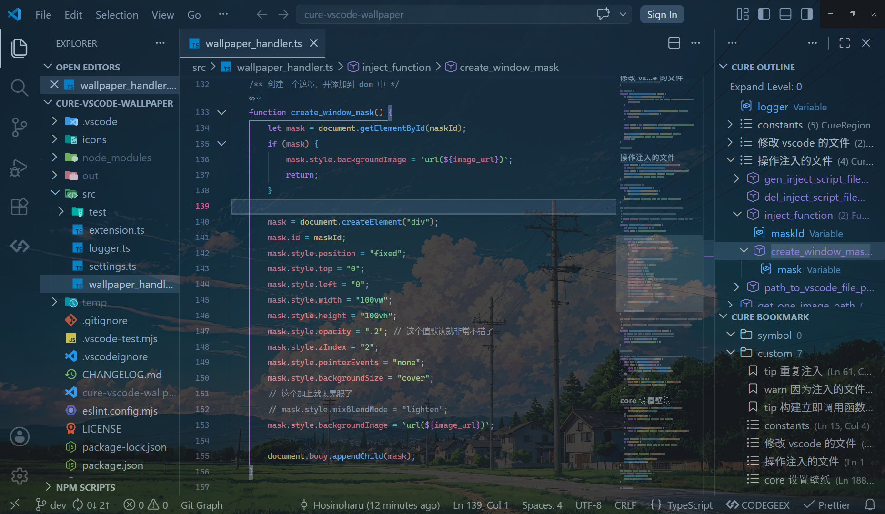
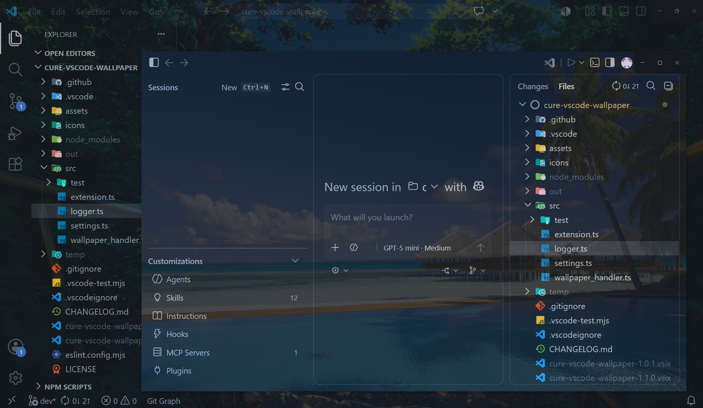

<h1 style="text-align: center; color: #FE5B9B;">Cure VSCode Wallpaper</h1>

这是一个 `VSCode` 插件，用于设置 `VSCode` 背景图片。

`Agents Window` 也有壁纸。

# Usage

插件没有发布到 `VSCode Marketplace` 中，需要手动安装。

打开插件的配置，启用功能、设置图片所在的目录，然后执行命令 `Set Wallpaper` 立即设置壁纸。

之后，`VSCode` **每次启动时，会从图片目录中随机选一张图片作为壁纸**，

插件提供两个命令：

-   `Set Wallpaper`：随机选一张图片作为壁纸，会重新加载 `VSCode` 让其生效 —— 插件功能未开启时，此命令无效
-   `Reset Wallpaper`：重置壁纸 —— **删除插件之前一定要先还原**，也会重新加载 `VSCode` 让其生效

插件就只有这一个简单的功能。

-   不支持调整图片大小、填充方式等等
-   不支持手动指定图片
-   不支持设置侧边栏、控制台、编辑区等不同区域的背景

>   [!NOTE]
>
>   插件会修改 `VSCode` 自身的文件，具体见[about design · Hosinoharu/cure-vscode-wallpaper Wiki](https://github.com/Hosinoharu/cure-vscode-wallpaper/wiki/about-design)，所以会弹窗提示 `VSCode` 已经损坏，无需担心。
>
>   每次 `VSCode` 更新之后，因为修改的文件被重置，所以需要重新执行 `Set Wallpaper` 命令设置壁纸。

# Attribution

[Extension icon created by Good Ware - Flaticon](https://www.flaticon.com/free-icon/picture_685681)

